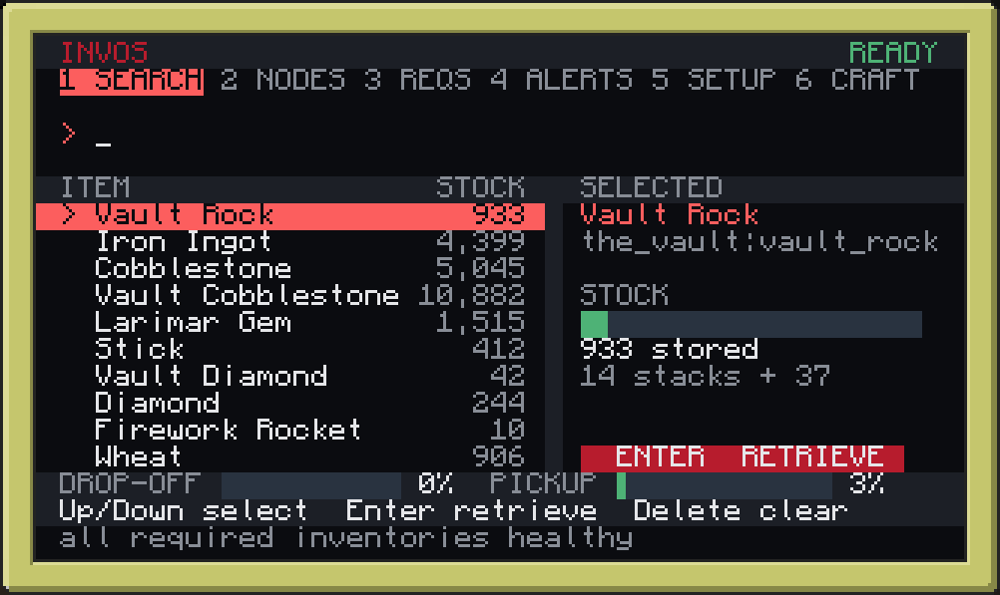
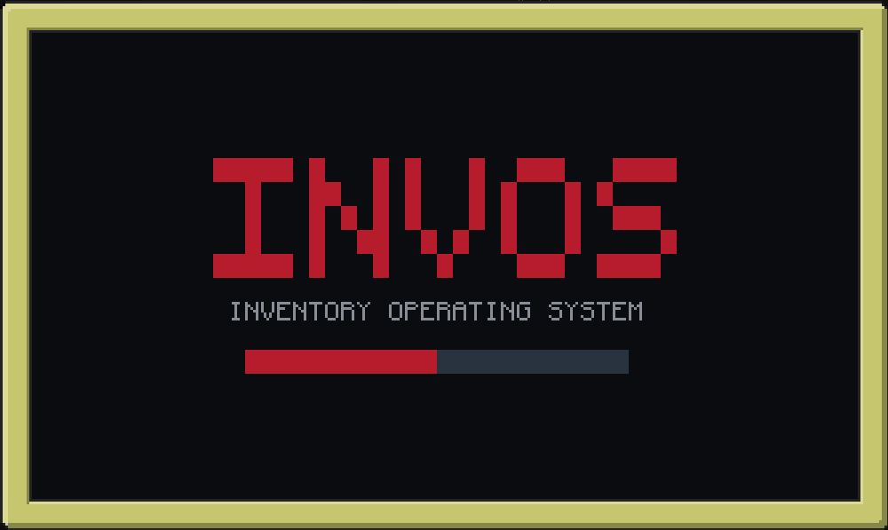
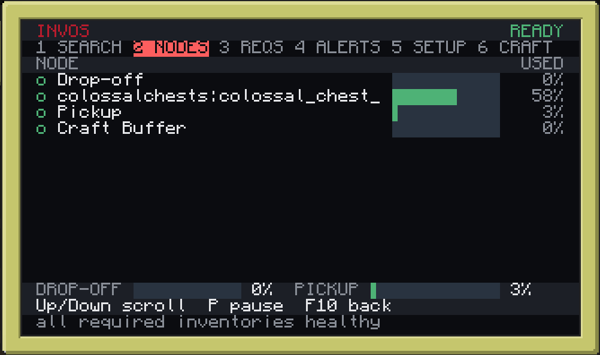
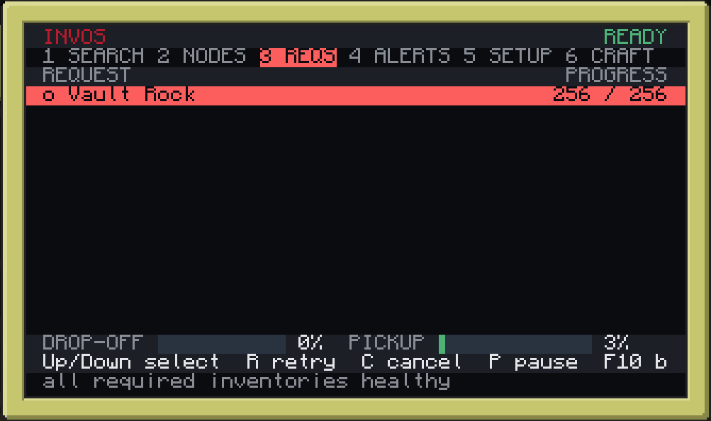
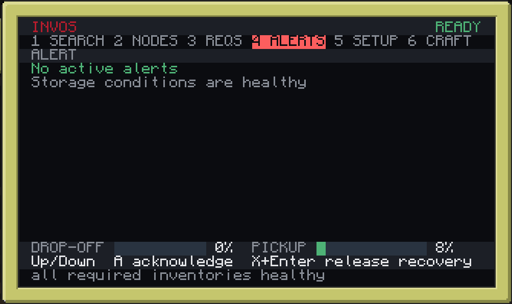
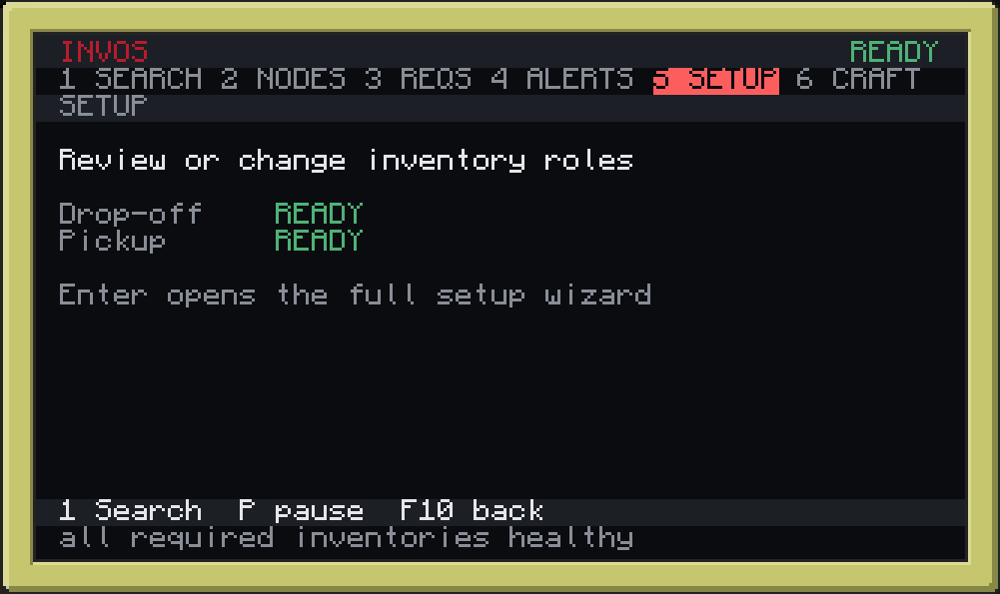
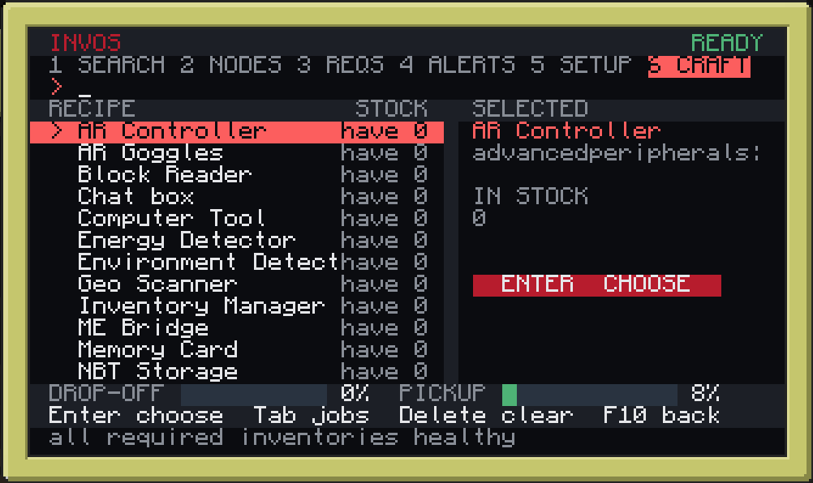
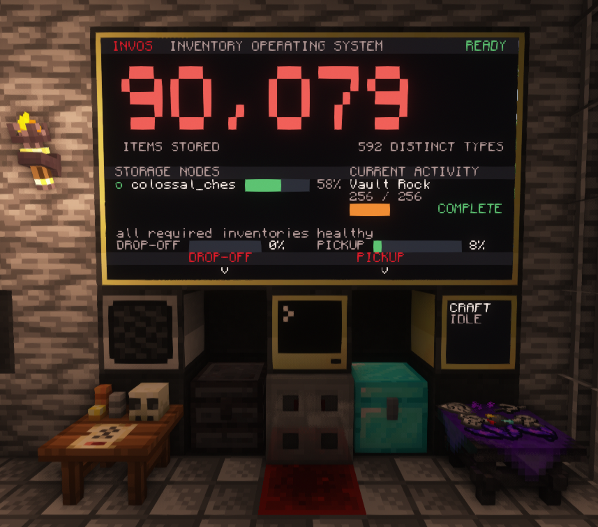

<div align="center">
  

  <p>
    A search-first storage terminal for CC:Tweaked, backed by pooled standard containers
    and an optional crafty-turtle crafting pipeline.
  </p>

  <p>
    
    
    
    
  </p>
</div>

---

Point a modpack's worth of storage at one wired network and get one searchable inventory
back. InvOS indexes every storage container you give it, takes deposits through a dedicated
Drop-off, fulfills exact item-and-quantity requests into a dedicated Pickup, and — if you
give it a spare turtle — plans and executes multi-step crafting against your own live
recipe set. No mainframe, no external database: it's one advanced computer, some wired
modems, and over 1,000 tests standing behind it.

## Why InvOS

- **Search-first.** Type part of a name, get live results while background scans keep
  indexing. No menu tree to dig through.
- **One pooled store.** Any number of standard containers appear as a single inventory with
  priority ordering, not a wall of separate chests to check by hand.
- **NBT-aware.** Distinct NBT variants of the same item are tracked and requested
  separately, so you get the enchanted pickaxe you asked for, not just *a* pickaxe.
- **Crafting that plans ahead.** Ask for 250 sticks and the planner resolves ingredients,
  tags, and multi-step trees against what's *actually in stock* — not a fixed recipe
  ordering — and drives a stationary crafty turtle to make them.
- **Built to survive a restart.** Every in-flight transfer is journaled before the
  inventory call that makes it real. A crash mid-transfer reconciles from measured storage
  deltas on the next boot; nothing is replayed blind and nothing is assumed.
- **Honest about failure.** Full inventory, an offline node, an unprovable journal — every
  one of these becomes a named, operator-actionable alert instead of a silent stall.

## What it looks like

InvOS runs on the computer's own terminal for search and control, with an optional large
status monitor and a 1×1 crafting monitor for anyone walking by:

<p align="center">
  
</p>

Solid blocks are background-filled cells: the ComputerCraft font has no box-drawing
characters, so structure is color or it is nothing. The page you are on is filled in the
selection color, the nav gives up its spacing and then its longer labels as the screen
narrows, and the whole bar is clickable.

A cold boot plays a brief animated wordmark on the terminal before the application takes
over — see [`controller/storage/app/splash.lua`](controller/storage/app/splash.lua).

## Screenshots

<table>
<tr>
<td align="center" width="50%">
<br>
<b>Boot splash</b> — the animated wordmark shown on cold boot
</td>
<td align="center" width="50%">
<br>
<b>Search</b> — live-filtered item list with stock, retrieval, and progress bars
</td>
</tr>
<tr>
<td align="center" width="50%">
<br>
<b>Nodes</b> — every bound inventory node with live utilization
</td>
<td align="center" width="50%">
<br>
<b>Requests</b> — outstanding pickups with per-request progress
</td>
</tr>
<tr>
<td align="center" width="50%">
<br>
<b>Alerts</b> — operator-actionable warnings, or confirmation of a healthy system
</td>
<td align="center" width="50%">
<br>
<b>Setup</b> — reviewing and changing inventory roles
</td>
</tr>
<tr>
<td align="center" width="50%">
<br>
<b>Craft</b> — browsing craftable recipes and current stock
</td>
<td align="center" width="50%">
<br>
<b>Status monitor</b> — the public wall display beside the terminal
</td>
</tr>
</table>

These are captured in game, so they include the computer's Minecraft GUI frame. The same
screens can be rendered headlessly from the emulator — same font, same palette, no frame —
which is how a UI change gets checked without logging in; see
[`docs/emulator.md`](docs/emulator.md).

## Features

- Responsive, search-first advanced-computer UI, keyboard- and mouse-driven
- A deliberate sixteen-color palette, shared by every screen, restored on exit
- Resizable public status monitor, auto-detecting its own size tier, with the stored-item
  total in block digits readable across a base
- Multiple labeled, priority-ordered storage nodes pooled as one store
- Exact wired-inventory transfers with durable journaling and reconciliation
- Dedicated drop-off and pickup inventories, decoupled from storage
- NBT-aware indexing and requests
- Configuration-and-alias floppy backup
- Optional multi-step crafting through a stationary crafty turtle, from a recipe pack
  generated straight from the running game

Crafting is entirely optional: it's only constructed when a buffer inventory and a turtle
are both bound in configuration. Leave them unbound and nothing else changes.

## Quick start

1. Wire one advanced computer, a dedicated Drop-off inventory, a dedicated Pickup
   inventory, every storage container interface, and (optionally) a crafty turtle with its
   buffer chest, all onto one wired modem network.
2. Copy only the paths listed in
   [`controller/storage/deployment_manifest.lua`](controller/storage/deployment_manifest.lua),
   relative to `controller/`, onto the computer. Never copy tests, docs, or development
   helpers — they're excluded by design.
3. Boot the computer. `startup.lua` launches `/storage/main.lua` automatically and opens
   the full-screen setup wizard on first run. Setup stays read-only until you explicitly
   save.
4. Deposit items in Drop-off. InvOS imports them into priority order automatically, and
   indexes anything already sitting in storage.

Full topology, setup, recovery, upgrade, and deployment-safety details live in
[`docs/operations.md`](docs/operations.md) — read it before touching a live installation.

## Usage

Type any part of an item name on the Search page; results update live as background scans
continue. Select an item, resolve an exact NBT variant if there is one, and request a
single item, a stack, everything available, or an exact number. Digit keys `1`–`5` jump
straight to Search, Nodes, Requests, Alerts, and Setup; `F10` always returns to Search.

With a turtle and buffer bound, key `6` opens Crafting: pick a craftable output — including
ones you currently hold none of — enter a quantity, review the plan, and commit. A quantity
means *make that many*, not *top up to that many*; the "up to" behavior is an ordinary
Search retrieval.

## Architecture

- `controller/` — the deployable CraftOS controller.
  - `storage/app/` — services, coordination, setup, UI, and monitor rendering. The
    presentation layer is shared: `theme.lua` (palette and semantic roles), `draw.lua`
    (drawing primitives), `layout.lua` (screen regions), `buffer.lua` (double buffering).
  - `storage/core/` — inventory scanning, indexing, planning, transfers, and
    reconciliation.
  - `storage/shared/` — runtime, codec, and durable-store helpers.
  - `storage/recipes/` — the generated crafting recipe pack; never hand-edited.
- `turtle/` — the crafting turtle's own deployable tree. It never shares files with the
  controller in either direction.
- `tools/` — host-side build tooling that is never deployed: `recipe_import.py` builds the
  recipe pack, `deploy.py` gates every live deployment, and `emulator/` boots the controller
  in [CraftOS-PC](https://www.craftos-pc.cc) to drive and screenshot it headlessly.

See [`AGENTS.md`](AGENTS.md) for the full set of runtime and crafting invariants this
system is built against — the reasoning behind the design, not just the shape of it.

## Development

```bash
# Lua suite (from controller/)
lua storage/tests/run.lua

# Python suite (from tools/)
python -m unittest test_recipe_pack test_recipe_import

# Emulator harness (from tools/emulator/) — the second command boots CraftOS-PC
python3 -m unittest test_rawterm test_scenario test_render test_session
python3 -m unittest test_smoke test_smoke_nbt

# Boot the real thing in an emulator and screenshot it, headlessly
python3 tools/emulator/craftos.py shot --keys "type:vault" --out /tmp/search.png
```

InvOS runs unmodified in [CraftOS-PC](https://www.craftos-pc.cc), so a change can be booted
under the same Lua 5.2 ComputerCraft uses — the host suite runs on 5.4 — and its terminal
read back as text or rendered to a PNG. See [`docs/emulator.md`](docs/emulator.md).

See [`CONTRIBUTING.md`](CONTRIBUTING.md) for the full development workflow, testing
expectations, and the live-deployment safety rules that apply to any change touching a real
installation. Known gaps and untested paths are tracked openly in
[`docs/backlog.md`](docs/backlog.md).

## License

No license has been chosen for this repository yet. Until one is added, all rights are
reserved by default — open an issue if you'd like to use this code and a license hasn't
shown up.
